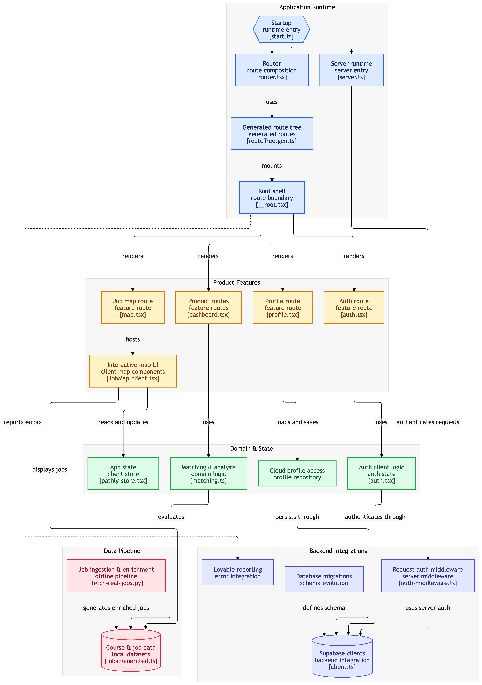

# Pathly

**Your career, mapped.** Pathly is an interactive map of Australian job opportunities that shows you exactly how your skills stack up against every role — and exactly what to learn to unlock more of them.

## The problem

Job search is opaque. Candidates apply blind, with no signal on whether they're actually qualified, and even a rejection tells them nothing about what would make them competitive. Pathly replaces that guesswork with a transparent, personalised, and honest picture of the job market.

## What it does

- **Opportunity map** — every curated role plotted on a live map of Australia, so discovery is visual instead of an endless list.
- **Transparent match scoring** — every job shows a percentage match plus *why*: skills you have, skills you partly cover, and skills you're missing. No black box.
- **Personalised, sorted listings** — the job list is always sorted by your match score, and a one-click "My matches only" filter narrows it to your strong and potential fits.
- **Career Gap simulator** — pick a skill you're considering learning and see exactly how many more roles it would unlock, and where.
- **CV-driven profiles** — upload a real CV (PDF, `.docx`, `.txt`, `.md`) and Pathly extracts your actual skills, experience level, and career goal to drive every match score from day one.
- **Guided onboarding** — a short, skippable wizard for new members (CV → skills/experience → LinkedIn/GitHub/portfolio → done), plus a "Getting Started" checklist on the dashboard that nudges you toward the actions that make matches personal (upload CV, browse the map, save or track a role).
- **Application tracker** — a kanban board across Saved → Tracking → Applied → Interview → Offer/Rejected. "Tracking" exists specifically so Pathly never claims to have submitted an application on your behalf when it's only bookmarked your interest.
- **Learning recommendations** — course suggestions mapped to every skill gap Pathly finds.
- **Employer job posting** — businesses can describe a role in plain English and Pathly turns it into a structured, mappable listing.
- **Guest mode** — explore the full demo instantly with a sample profile; nothing is saved to an account.

## Honesty by design

Pathly is careful not to overclaim. Job data is a curated, clearly-labelled demo dataset (not a live feed), match scores are computed from real profile data rather than invented, and the app never claims an application was submitted when it was only tracked. This is enforced by an automated test suite (`bun test`) that checks the landing page, job curation, and application flow for exactly this kind of overclaiming.

## Tech stack

- [TanStack Start](https://tanstack.com/start) (React, file-based routing, SSR)
- TypeScript
- Tailwind CSS v4
- [MapLibre GL](https://maplibre.org/) for the map
- [Supabase](https://supabase.com/) for auth and cloud profile storage
- [Bun](https://bun.sh/) as the package manager and dev runtime

## Getting started

You'll need [Bun](https://bun.sh/) installed.

```sh
bun install
```

Create a `.env` file in the project root with your Supabase project's public credentials:

```sh
VITE_SUPABASE_URL=your-project-url
VITE_SUPABASE_PUBLISHABLE_KEY=your-publishable-key
```

CV upload uses AI to extract skills and experience. Inside Lovable this works automatically, but a plain local `bun dev` has no access to Lovable's internal key, so also add a free key from [Google AI Studio](https://aistudio.google.com/apikey):

```sh
GEMINI_API_KEY=your-gemini-api-key
```

Then start the dev server:

```sh
bun dev
```

Open the printed local URL (typically `http://localhost:8080`).

## Other scripts

```sh
bun run build     # production build
bun run test      # run the honesty/behaviour test suite
bun run lint      # eslint
bun run format    # prettier --write
```

## Architecture

A visual map of how the codebase fits together — runtime entry points, feature routes, shared domain/state, and backend integrations:



## Project structure

```
src/
  routes/          # file-based routes (dashboard, map, career-gap, profile, onboarding, ...)
  components/pathly/  # Pathly-specific UI (map, search, filters, job cards, drawer)
  components/ui/   # shadcn/ui primitives
  lib/             # matching engine, auth, profile state, CV parsing
  data/            # job listings and static reference data
tests/             # behavioural tests (node:test / bun test)
```
